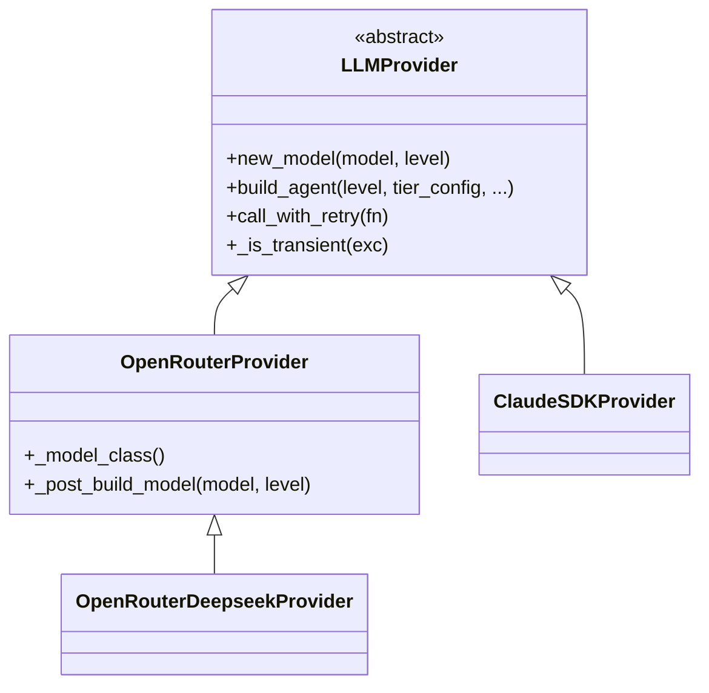

## Introduction

This document is the architectural complement to [README.md](README.md):
where README explains *how to use* `robotsix-llmio` (which provider to
import, which `level` and transport to configure, how to wire optional
Langfuse tracing),
this document explains *how the code is organised and why*. It is
descriptive of the current source tree on this branch, not aspirational.
For the usage surface (install, examples, environment variables), refer
back to [README.md](README.md).

## Layer model and inheritance graph

The library is organised into three logical roles:

- **Core (`robotsix_llmio.core`)** — the provider-agnostic base. It
  defines the `LLMProvider` ABC (with `level`-based model construction),
  bounded retry/backoff with rate-limit-aware fallback, the baked
  numeric constants (timeouts, retry counts, backoff schedules), the
  timeout-bounded async HTTP client, the generic pydantic-ai `Agent`
  assembler, the cost-on-span helpers, and the optional Langfuse OTLP
  export plumbing.
- **Transport layers** — each speaks one wire protocol but stays
  model-family-agnostic. There are two siblings, both deriving directly
  from `core.LLMProvider`:
  - `robotsix_llmio.openrouter` — OpenRouter transport: auth / base URL
    / `usage.include` opt-in / cost extraction from `usage.cost` /
    OpenRouter-specific transient signature. `OpenRouterProvider` is
    concrete: the model name is resolved from `TierConfig` by the caller.
  - `robotsix_llmio.claude_sdk` — Claude Agent SDK transport: drives
    the local `claude` CLI through `claude_agent_sdk` (no API key —
    authenticates via your `claude login` session). Concrete: ships default
    model name resolved by `TierConfig` (defaults to `opus`).
- **Derived DeepSeek classes (`robotsix_llmio.openrouter`)** —
  `OpenRouterDeepseekProvider` and `OpenRouterDeepseekModel` live in the same
  `openrouter` package and extend `OpenRouterProvider` with DeepSeek-specific
  quirks (pinned upstream provider, per-level reasoning policy, `reasoning_content`
  round-trip), pinning model names to `deepseek/deepseek-v4-pro` /
  `deepseek/deepseek-v4-flash`.



`claude_sdk` is a **sibling** of `openrouter`, not a child — both
inherit from `core.LLMProvider` directly. The relevant class
declarations are in
[`src/robotsix_llmio/openrouter/provider.py`](src/robotsix_llmio/openrouter/provider.py)
(`class OpenRouterProvider(LLMProvider)`) and
[`src/robotsix_llmio/claude_sdk/provider.py`](src/robotsix_llmio/claude_sdk/provider.py)
(`class ClaudeSDKProvider(LLMProvider)`).

## File conventions inside each subpackage

The transport sub-packages follow a **three-file layout** so the wire
protocol, the per-tier construction, and the transient predicate stay
separable:

- `model.py` — the pydantic-ai `Model` subclass with cost recording and
  any wire-level quirks.
- `provider.py` — the `LLMProvider` subclass exposing the
  `_model_class()` / `_post_build_model()` hooks (for
  OpenRouter) or the concrete construction (for Claude SDK).
- `transient.py` — the provider-specific transient predicate that
  layers on `core.retry.is_transient`.

`openrouter/` and `claude_sdk/` both follow this layout in full.

`claude_sdk/` additionally carries `_task_budget.py`, which maps a tier's
`max_tokens` onto `ClaudeAgentOptions.task_budget`. The two are *not* the
same control — `max_tokens` is a hard per-response output cap, while
`task_budget` is an advisory whole-loop budget with an API-enforced
minimum — so the mapping clamps to that floor rather than emitting a
request the API would reject outright.

`openrouter/` contains both the base `OpenRouterProvider` / `OpenRouterModel`
and the derived DeepSeek classes (`OpenRouterDeepseekProvider`,
`OpenRouterDeepseekModel`). The DeepSeek classes inherit OpenRouter's
transient signature via `OpenRouterProvider._is_transient`. The package's
`__init__.py` docstring is the canonical statement:

> Requires the `openrouter` extra (which pulls the OpenRouter transport
> deps). The model/provider are loaded lazily via PEP 562 `__getattr__`
> so a missing extra surfaces a clear install hint only when the
> model/provider is actually used. Transient retry is inherited from
> the OpenRouter layer (the DeepSeek classes add no DeepSeek-specific
> transient signature).

`core/` does **NOT** follow the model/provider/transient layout — it
has no single model or provider; it is the base layer. Its actual
files are:

- `provider.py` — the `LLMProvider` ABC and `TierLevel` (in `config.tier`),
  plus the inherited `build_agent` / `call_with_retry` methods that
  derived providers reuse unchanged.
- `agent.py` — `AgentHandle` (wraps a pydantic-ai `Agent` with its
  httpx client for deterministic close, delegating attribute access so
  call sites stay unchanged) and the generic `build_agent` function.
- `http.py` — `timeout_http_client()`: an httpx `AsyncClient` configured
  with `MODEL_REQUEST_TIMEOUT` + `CONNECT_TIMEOUT` plus a
  `weakref.finalize` backstop that calls `aclose()` in a fresh event
  loop if the client is garbage-collected without an explicit close.
- `retry.py` — `call_with_retry`, `call_with_retry_and_fallback`,
  `is_transient`, `is_rate_limited`, and the bounded cause-chain walker
  `_walk_cause_chain`.
- `constants.py` — the baked numeric parameters
  (`MODEL_REQUEST_TIMEOUT`, `CONNECT_TIMEOUT`, `SDK_QUERY_TIMEOUT`,
  `TRANSIENT_RETRIES`, `TRANSIENT_BACKOFF_BASE`, `TRANSIENT_BACKOFF_CAP`).
- `cost.py` — the generic `record_cost(response, get_cost)` that pulls
  a USD value from a response and stamps `gen_ai.usage.cost` +
  `langfuse.observation.cost_details` onto the active OTel span, plus
  `flush_current_provider()` for retry-time exports.
- `_otel.py` — the implementation home of the span helpers
  (`get_recording_span`, `get_tracer`, `start_span`). The functions have
  public names so they can be cleanly re-exported, but the **module
  itself stays internal** (the leading underscore): the helpers are the
  public surface, `_otel` is not. `cost.py` and `retry.py` import them
  intra-package from `._otel` directly; everyone else uses `tracing.py`.
- `tracing.py` — optional Langfuse OTLP wiring
  (`setup_langfuse_tracing`, `langfuse_session`, `langfuse_project`,
  `start_trace`, `TraceSpan`, `flush_tracing`,
  `install_signal_handlers`); single- and multi-tenant routing via a
  stamp processor that tags every span with the active public key and a
  per-project filtered batch exporter. Also re-exports the public span
  helpers (`get_recording_span`, `get_tracer`, `start_span`) from
  `_otel.py` as part of its public surface (also available from
  `core.__init__`).

  **Provider import rule:** sibling sub-packages (`openrouter`,
  `claude_sdk`, …) MUST import tracing helpers only from `core.tracing`
  or `core.__init__`, never from the private `core._otel`. The
  underscore module may be refactored or merged into `core.tracing`
  later; routing provider imports through the public surface keeps them
  insulated from that internal churn.

## The PEP 562 `__getattr__` lazy-import convention

All package `__init__.py` files use a module-level
[PEP 562](https://peps.python.org/pep-0562/) `__getattr__` to defer the
import of `model` / `provider` until the heavy symbol is actually
accessed. The same convention serves two purposes at once:

1. Importing the lightweight `transient` helpers (cheap predicates used
   at retry-decision sites) does not drag in `pydantic-ai`, OpenTelemetry,
   `httpx`, or the Claude Agent SDK at module load.
2. For the optional-extra packages (`openrouter`, `claude_sdk`),
   a missing extra surfaces as a clear `ImportError` with an install
   hint **only when the heavy symbol is touched**, not on a plain
   `import robotsix_llmio.openrouter`. The hint wording —
   reused verbatim across the optional-extra packages so future
   contributors copy it — looks like:

   ```python
   raise ImportError(
       "robotsix_llmio.openrouter requires the "
       "'openrouter' extra. Install with: "
       "pip install 'robotsix-llmio[openrouter]'"
   ) from exc
   ```

**Applied in** (all seven package `__init__.py` files):

- `src/robotsix_llmio/claude_sdk/__init__.py`
- `src/robotsix_llmio/config/__init__.py`
- `src/robotsix_llmio/core/__init__.py`
- `src/robotsix_llmio/clients/knowledge/__init__.py`
- `src/robotsix_llmio/openrouter/__init__.py`
- `src/robotsix_llmio/clients/refdocs/__init__.py`
- `src/robotsix_llmio/clients/self_review/__init__.py`

## Design decisions worth knowing

The following decisions are visible in the code today; each one has a
short rationale grounded in the source.

- **Baked constants, not a config object.** Every numeric parameter
  (`MODEL_REQUEST_TIMEOUT`, `CONNECT_TIMEOUT`, `SDK_QUERY_TIMEOUT`,
  `TRANSIENT_RETRIES`, `TRANSIENT_BACKOFF_BASE`, `TRANSIENT_BACKOFF_CAP`) is a module
  constant in `core/constants.py` by design: the consumer's only choice
  is provider + tier. If a derived layer needs an override, it adds it
  explicitly — not as a general knob.
- **Level-based selector via `TierConfig`, not raw model strings.**
    Consumers pass a capability `level` (1, 2, or 3) to
    `LLMProvider.build_agent()` or `create_model()`. The
    level→(transport, model) resolution is handled by `TierConfig`
    (schema in `config/tier.py`), which merges baked defaults,
    environment variables, and explicit overrides. The caller never
    types a raw model name unless bypassing tier config entirely
    via `new_model(model=..., level=...)`.
- **Hook-based extension on `OpenRouterProvider`.** The two
    overridable hooks — `_model_class()`, `_post_build_model()` —
    are the contract a per-family derived layer fills in.
    `openrouter.provider` is the worked example: it pins
    the model class and stamps per-level reasoning policy in
    `_post_build_model`.
- **`AgentHandle` for deterministic cleanup.** `core/agent.py` wraps
  the pydantic-ai `Agent` together with its httpx client; callers call
  `.close()` to tear the client down explicitly. Attribute access
  delegates to the wrapped agent, so existing call sites stay unchanged.
- **`weakref.finalize` backstop on the httpx client.** `core/http.py`
  registers a finalizer that calls `aclose()` in a fresh event loop if
  the client is garbage-collected without explicit close. Belt-and-braces
  against a forgotten `agent.close()`.
- **Provider-extensible transient predicate.** `core.retry.call_with_retry`
  takes an `is_transient_fn`; the provider base wires it from
  `LLMProvider._is_transient` (overridable). OpenRouter widens it with
  `is_openrouter_upstream_error` (the `finish_reason='error'`
  ValidationError signature). Claude SDK widens it with
  `_SDK_TRANSIENT_NAMES` (CLI subprocess/transport failures plus the
  `ClaudeSDKQueryTimeout` stall) **and** explicitly excludes the
  turn-cap failure (`ClaudeSDKTurnLimitError`) so it fails loudly
  instead of looping.
- **Hard vs transient SDK failures.** `claude_sdk/_errors.py`
  distinguishes `ClaudeSDKQueryTimeout` (a stalled subprocess — treated
  as transient so the bounded retry re-runs it) from
  `ClaudeSDKTurnLimitError` (the agent loop did not converge within
  `max_turns` — a hard failure, never retried). Both wrap the SDK's own
  behaviour.
- **Cause-chain walking.** `core/retry._walk_cause_chain` traverses
  `__cause__` / `__context__` with bounded depth (10), so a transient
  wrapped by pydantic-ai or the OpenAI SDK (for example
  `ModelHTTPError <- APITimeoutError <- httpx.ReadTimeout`) is still
  classified correctly.

## Cost recording — where it happens, what it stamps

There is no central "cost collector". Every transport model stamps cost
onto whatever OpenTelemetry span is currently recording, and the
optional Langfuse exporter ships those attributes verbatim.

- **Generic helper.** `core/cost.py:record_cost(response, get_cost)`
  pulls a USD value out of the response via the caller-supplied getter
  and, when an OTel span is recording, stamps
  `gen_ai.usage.cost`, `gen_ai.operation.name = "chat"`, and
  `langfuse.observation.cost_details = {"total": cost}` (the last is a
  harmless span attribute on backends that don't consume it).
- **OpenRouter cost.** `openrouter/model.py:record_openrouter_cost`
  extracts the cost from `response.usage.cost` — looking at
  `usage.model_extra` first (where pydantic stashes fields the upstream
  schema doesn't model) and falling back to a direct attribute — and
  stamps the generic attributes plus
  `gen_ai.provider.name = "openrouter"`, `gen_ai.system = "openrouter"`,
  `gen_ai.request.model`, and input / output / reasoning / cache token
  counts pulled from `usage.prompt_tokens_details` and
  `usage.completion_tokens_details`. It is called from
  `OpenRouterModel._completions_create` immediately after
  `super()._completions_create`. The OpenRouter `usage.include = true`
  opt-in (injected into `model_settings.extra_body` by
  `_inject_usage_include`) is what makes `usage.cost` appear in the
  response in the first place.
- **DeepSeek cost.** Inherited unchanged from `OpenRouterModel`;
  `OpenRouterDeepseekModel` only adds the upstream-provider pin and
  per-level reasoning policy on top, not new cost logic.
- **Claude SDK cost.** `claude_sdk/_model.py:ClaudeSDKModel.request`
  calls the generic helper
  `core.cost.record_cost(result, lambda r: getattr(r, "total_cost_usd", None))`
  after the SDK loop, reading the cost from the SDK's `ResultMessage`.
  The injected-MCP-tools path
  (`claude_sdk/provider.py:_SdkToolAgentHandle._run`) calls the same
  helper on a *child* generation span — the agent-run span is the trace
  root, so cost must live on a child observation for Langfuse to roll it
  up.

## Tracing layout (high level)

Tracing lives next to cost recording because the cost attributes are
just span attributes that the tracing exporter ships.

- `core/tracing.setup_langfuse_tracing` registers one OTLP exporter per
  Langfuse project. A single `_StampProcessor` stamps `session.id`,
  `langfuse.session.id`, and the active `langfuse.public_key` onto every
  span; a `_FilteredBatchSpanProcessor` per project forwards only the
  spans whose stamped public key matches that project. That stamp +
  filter pair is the multi-tenant routing seam.
- `langfuse_session` / `langfuse_project` / `start_trace` are
  `contextvars`-backed scopes, so async work composes correctly: each
  task inherits the contextvar snapshot at spawn time.
- Without `LANGFUSE_PUBLIC_KEY` + `LANGFUSE_SECRET_KEY`,
  `setup_langfuse_tracing` is a no-op returning `False`. The whole
  subsystem is opt-in and graceful; importing `core.tracing` without
  the `tracing` extra installed is still safe — only calling
  `setup_langfuse_tracing` actually pulls the OTLP exporter.

## Test coverage strategy

The `tests/` tree mirrors the source layout, with one per-module
sub-directory for modules that have their own test suite:

- `tests/core/` — unit tests for the base layer (selected highlights;
  see directory for full listing):
  - `test_changelog.py` — changelog utilities.
  - `test_constants.py` — module-level constants.
  - `test_core_agent.py` — core agent unit tests.
  - `test_core_cost.py` — cost model unit tests.
  - `test_core_cost_log.py` — cost log unit tests.
  - `test_core_http.py` — HTTP client unit tests.
  - `test_core_private.py` — internal/private API unit tests.
  - `test_core_provider.py` — the `LLMProvider` contract.
  - `test_core_provider_cost.py` — provider cost tracking.
  - `test_core_retry_sync.py` — sync wrappers, retry-then-fallback.
  - `test_core_retry_async.py` — async parity, retries-exhausted,
    rate-limit, backoff jitter.
  - `test_core_retry_properties.py` — property tests.
  - `test_core_run.py` — top-level run loop unit tests.
  - `test_core_tier_fallback.py` — tier-fallback unit tests.
  - `test_core_tier_fallback_next_tier.py` — next-tier fallback unit tests.
  - `test_exceptions.py` — custom exception classes.
  - `test_factory.py` — agent factory unit tests.
  - `test_factory_levels.py` — capability-level factory tests.
  - `test_identifier.py` — agent identifier unit tests.
  - `test_langfuse_async_client.py` — async Langfuse client.
  - `test_langfuse_client.py` — sync Langfuse client.
  - `test_langfuse_cost.py` — Langfuse cost tracking.
  - `test_logging.py` — logging configuration unit tests.
  - `test_otel.py` — OpenTelemetry setup unit tests.
  - `test_sqlite_utils.py` — SQLite utility unit tests.
  - `test_text_utils.py` — text utility unit tests.
  - `test_tracing_setup.py` — tracing setup + surface API unit tests.
  - `test_tracing_routing.py` — trace routing + span processor unit tests.
  - `test_tracing_live.py` — live tracing (opt-in).
- `tests/clients/` — unit tests for the client layer:
  - `_base/test_base.py` — base client unit tests.
  - `knowledge/test_knowledge.py` — knowledge client unit tests.
  - `refdocs/test_refdocs.py` — refdocs client unit tests.
  - `self_review/test_self_review.py` — self-review client unit tests.
- `tests/config/` — unit tests for the config layer:
  - `test_config_factory.py` — config factory unit tests.
  - `test_config_integration.py` — config integration tests.
  - `test_lazy_imports.py` — lazy imports tests.
  - `test_loader.py` — config loader unit tests.
  - `test_tier.py` — tier config unit tests.
- `tests/openrouter/`:
  - `test_openrouter.py` — OpenRouter transport unit tests.
  - `test_openrouter_deepseek.py` — unit tests for the DeepSeek derived layer.
  - `test_openrouter_deepseek_live.py` — live tests; reproduces the DeepSeek
    thinking-mode 400 that the `reasoning_content` round-trip fixes.
  - `test_async_client.py` — ``AsyncOpenRouterClient`` unit tests (httpx.MockTransport,
    no network).
  - `test_openrouter_provider.py` — ``OpenRouterProvider.__init__`` auth resolution
    unit tests.
  - `test_openrouter_provider_cost.py` — provider-cost read seam unit tests.
- `tests/claude_sdk/`:
  - `test_confine_hook.py` — exercises the workspace-confinement
    `PreToolUse` hook used by the injected-MCP-tools path.
  - `test_live.py` — live Claude SDK tests (opt-in).
  - `test_output.py` — output parsing unit tests.
  - `test_prompt_rendering.py` — prompt rendering unit tests.
  - `test_run_kwargs.py` — run-kwargs propagation unit tests.
  - `test_stream.py` — streaming response unit tests.
  - `test_task_budget.py` — `task_budget` floor/clamp unit tests.
  - `test_tool_bridge.py` — tool-bridge unit tests.
  - `test_tracing.py` — Claude SDK tracing unit tests.
  - `test_transient.py` — transient-error classification unit tests.
  - `test_usage.py` — usage/cost tracking unit tests.

**Live-test gating.** Live tests are opt-in via the `live` pytest
marker. `pyproject.toml` deselects them by default
(`addopts = "-m 'not live'"`) and declares the marker
(`markers = ["live: tests that require a live API connection and OPENROUTER_API_KEY"]`).
Run them explicitly with `pytest -m live`; they additionally self-skip
without `OPENROUTER_API_KEY` (or, for the Claude SDK live path, a
logged-in `claude` CLI).

## Cross-references

- [README.md](README.md) — the usage surface (install, examples,
  environment variables, Langfuse wiring).
- [`pyproject.toml`](pyproject.toml) — the five optional extras
  (`openrouter`, `claude_sdk`, `tracing`, `docs`, `dev`) and the
  live-test marker configuration.
- [`docs/modules.yaml`](docs/modules.yaml) — the per-module path
  taxonomy (source / tests / docs paths per module id) consumed by the
  per-module tooling.
- The per-layer docstrings in each `__init__.py` — they are the
  authoritative one-paragraph statement of each layer's purpose. This
  document quotes them where appropriate but does not duplicate them.
